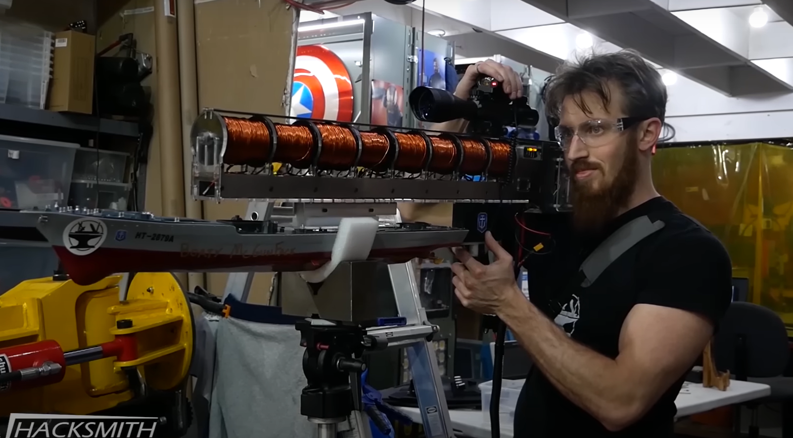

Journal.md
Tital: Coilgun
Author: Ziqi Guan
Desciption: The aim is to create a multi-stage coilgun with decent acceleration and speed. The desired range is 30-40 feet.
Created at: 6/17/2024

June 17th - Log 1
Started at 9:00 pm
Took a 45 min breka from 10:05-10:50 pm
Ended at 12:00 am (Midnight)
Session Time: 2 hrs 15 mins
Total Time: 2 hrs 15 mins

Premise: (NEED TO UPDATE SOME OTHER TIME)

Mainly did research and concept exploration. I have already done a lot of research, but a bit more wouldn't hurt, especially since the pcb for this will be decently complicated considering the sensors have to send signals with little delay.

Videos Watched for guidance and inspiration:
    https://www.youtube.com/watch?v=PMU9TQUDhow
    https://youtu.be/id90kjYh-Qw?si=KB8jq6l4MKs8E-xA     Electronoob
    https://www.youtube.com/watch?v=rotrRg4ZUpk
    https://www.youtube.com/watch?v=QTDcFxTq1Fw           Hacksmith
    https://youtu.be/AwRJsze_9m4?si=WbC6bxTEcL72BCi7      Engineering Mindset: Mosfets (Good guide to how mosfets work and why they are used over transisters)
    https://youtu.be/gADIb1Xw8PE?si=Rg8etwbdkOXKYFJh      Video all about IR and how to send and recieve
    https://youtu.be/X4EUwTwZ110?si=Mn7Il1-l6g907hk5      Engineering Mindset: Capacitors (Video all about Capacitors and how they work)

Question I have/Need to research:
    1.Instead of a detector on the side of the barrel, would it be possible to measure speed and distance with a single light sensor at the end of the barrel.

    Update: After doing some research and searching, the best way forward is to just have sensors on the side. While a single sensor would easily make everything easier, it also presents a lot of challenges that I might not be able to troubleshoot. Even though I want to use a method different than what everyone else uses, there isn't really a cheaper or more efficient method than IR sensors on the side of the barrel. 

    2.Should I use a low voltage system (Safer, easier, cheaper, weaker, and more accessable) or a high volatage capaciter system (Dangerous, harder, potentially more expensive, stronger, less accessable, bulkier, and more timing heavy).

    Update: After multiple considerations, using high voltage capacitors will probably work best. This is because their higher voltage means more current in the short amount of time. Of course that means that this might increase the price and caution should be taken when handling the parts. 

Key Things to note:
1.
    A: Inductive Loads take time to reach full current
    B: Resistive Loads reach full current almost immedietly and doesn't lag behind the voltage that much.

    That means the inductive loads we are using must be activated before the projectile enters the magnetic field for the electromagnet to reach its full stregnth. 
2.
    Most people are using high voltage capacitors. The pros and cons are still something I need to look at, but it seems like the better option for more speed. 
    I also believe that 3-4 stages will be more than enough given the many features I want to add that I have to figure out. 
3.
    Multiple systems need to be integrated together well, also high voltage capacitors seem like the best option. Main thing though is calculating the speed of the projectile and acceleration on the coilgun with speed as any latency could mean that coils get activated too late. 

Plans:
    The coilgun I wish to design should be completely mobile and be able to be held unlike most designs on the internet. Not only are most clunky with exposed wiring, I believe that it leads to inefficiency. While Electronoobs design of modularity was good, the amount of components needed in my opinion was not great. It should also have features such as a reload system (probably only 5 rounds or so), capacitor reading system (to indicate whether or not the capacitors are at full charge), and settings to disable stages (to reduce speed and acceleration). 

Photos: Will add more later because I don't want to just upload youtube screenshots right now. 

June 18th - Log 2
Started at 8:45 pm
Ended at 9:20 pm
Session Time: 35 mins
Total Time: 2 hrs 50 mins

Main Goals: 
1:
    Began a concept CAD on OnShape for the coilgun, while the PCB isn't designed yet and many things can change, a rough idea of what I'm working with helps a lot, especially with spacing. 
2: 
    Began working in kiCAD to design the PCB, although this is probably not going to be achievable as I have to design the circuit still, so more of a design circuit thing.
3:
    More of a task 2 part 2, but research more into the electrical componenets, if there are any ways to simplify the design, it would be great as the entire system has to be handheld 

Videos watched:
https://youtu.be/hNRzK9SiqQA?si=KOMdYGKCFp1c2ixh       Video about thyristors (potential option apart from a MOSFET)
https://youtu.be/vtoWxGVx5kA?si=DG7lvUVK3ucVBTBL       Electronoobs follow up video to his first coilgun video

Began to desgin coilgun PCB with a rough sketch.

